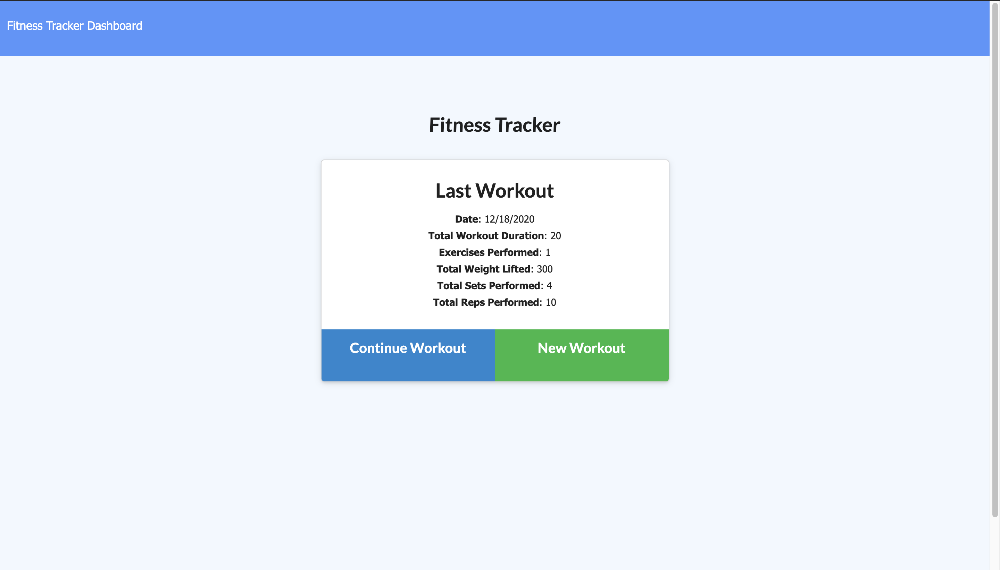
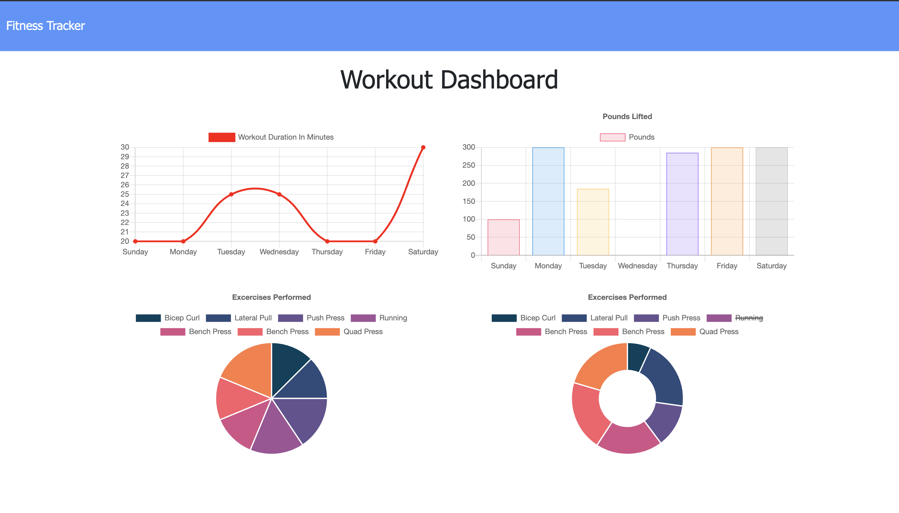

# Unit 17 Nosql Homework: Workout Tracker

## Description
For this assignment, I'll create a workout tracker. It's required to create Mongo database with a Mongoose schema and handle routes with Express.

## Project links
<li>GitHub link: https://github.com/huqian301/Workout-Tracker </li>
<li>Heroku link: https://happy-workout.herokuapp.com/</li>

## Output 
Here is the [Video](https://drive.google.com/file/d/1NM90FAbdNiVJnajCMXoWW2ENfatX-7GD/view?usp=sharing) that shows entire page. 

The final page will be look like as below image.

 
 

